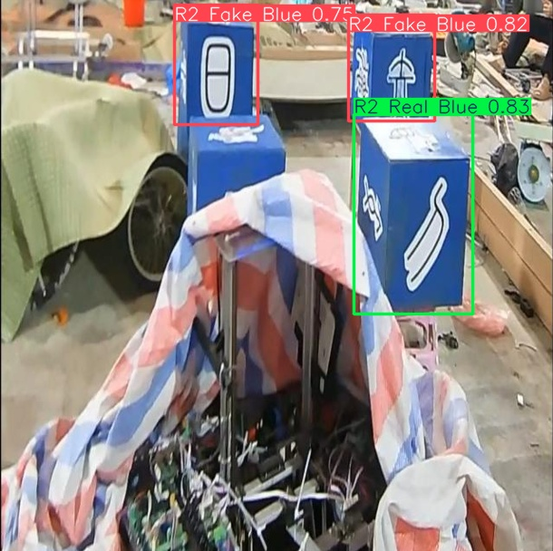
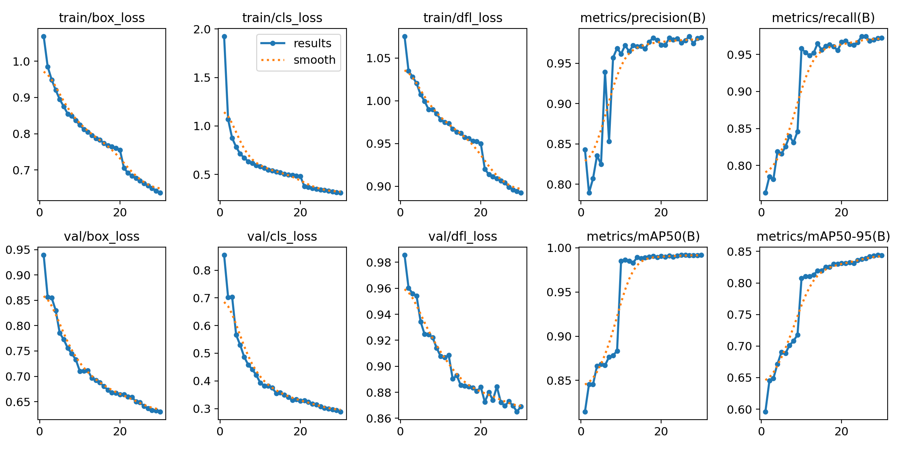
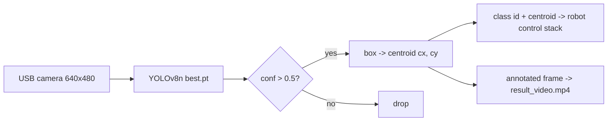
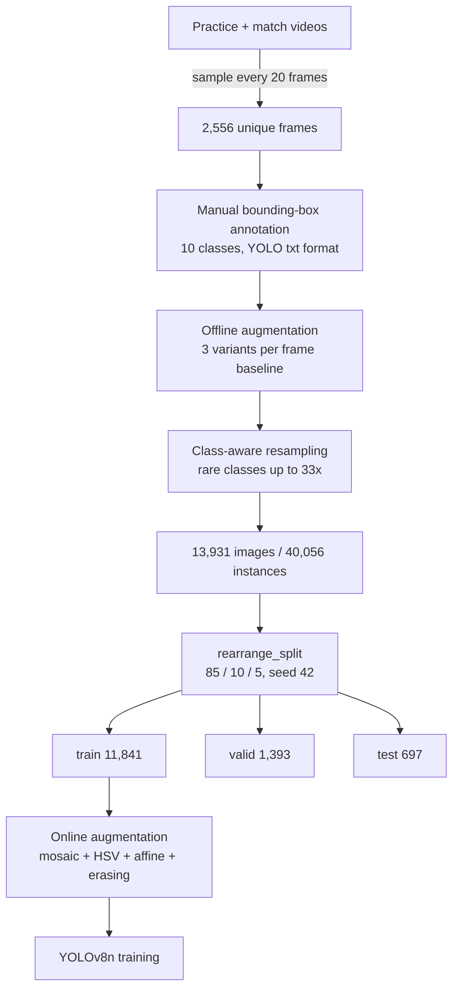
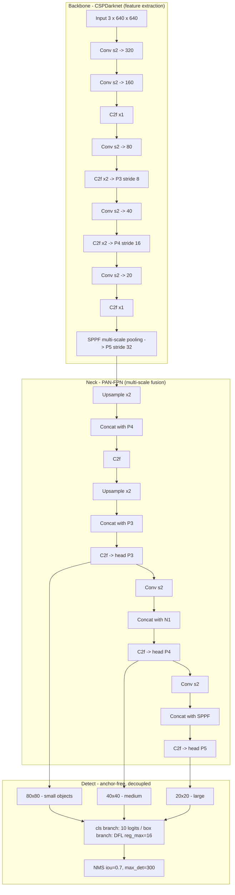

# KFS Object Detection — Robocon 2026

A YOLOv8-nano detector that finds and classifies the **KFS game elements** for our Robocon 2026 robot: red/blue team markers, real vs. decoy R2 blocks, spheres, and human hand signals — in real time, on-robot.

The interesting part of this project isn't the model. It's the **data pipeline**. I started out trying to bolt extra machinery onto YOLO — custom heads, attention blocks, loss tweaks — and got nowhere. What actually moved the needle was going back to the dataset: **2,556 raw video frames → 13,931 training images → 40,056 labelled instances**, built with a two-stage augmentation and class-aware resampling pipeline. That pipeline is documented in full below.

**Final model:** YOLOv8n · 3.01 M params · **mAP@50 = 0.992**, **mAP@50-95 = 0.844**, P = 0.982, R = 0.972 · 30 epochs in 2 h 11 m on a single GPU.

<p align="center">
  
  
</p>

---

## Table of contents

- [The problem](#the-problem)
- [Results](#results)
- [Repository layout](#repository-layout)
- [The data pipeline](#the-data-pipeline)
  - [1. Frame extraction](#1-frame-extraction)
  - [2. Annotation and the class set](#2-annotation-and-the-class-set)
  - [3. Offline augmentation](#3-offline-augmentation)
  - [4. Class-aware resampling](#4-class-aware-resampling)
  - [5. Splitting](#5-splitting)
  - [6. Online augmentation](#6-online-augmentation)
- [Model architecture](#model-architecture)
- [Training configuration](#training-configuration)
- [Reading the training curves](#reading-the-training-curves)
- [Setup](#setup)
- [Usage](#usage)
- [Known issues and next steps](#known-issues-and-next-steps)
- [What I learned](#what-i-learned)

---

## The problem

The Robocon 2026 field is full of look-alike objects. The robot has to answer three questions at ~30 FPS from a single RGB camera:

1. **Where is the target?** Bounding box → centre pixel `(cx, cy)` → fed to the aiming and navigation stack.
2. **Which team owns it?** Red variants vs. `Blue` variants of the same object.
3. **Is it real or a decoy?** `R2 Real` and `R2 Fake` are *physically identical boxes* that differ only by the pictogram printed on the face. This is the hard class pair, and it is the reason the dataset needed so much work.

Plus two human-in-the-loop gesture classes — `Hand` and `Fist` — used as start/stop signals from the operator.



---

## Results

Validation metrics on the 1,393-image validation split, YOLOv8n @ 640 px:

| Metric | Value |
|---|---|
| Precision (B) | **0.982** |
| Recall (B) | **0.972** |
| mAP@50 | **0.9918** |
| mAP@50-95 | **0.8437** (best 0.8443 @ epoch 29) |
| Params | 3,012,798 |
| Epochs | 30 |
| Wall-clock train time | 7,864 s ≈ **2 h 11 m** |
| Final train box / cls / dfl loss | 0.637 / 0.310 / 0.892 |
| Final val box / cls / dfl loss | 0.630 / 0.289 / 0.869 |

> **Read these numbers with the caveat in [Known issues](#known-issues-and-next-steps).** The split is done per-*image*, not per-*source frame*, so augmented siblings of the same original frame land in both train and val. The true generalisation number on unseen footage is lower. The epoch-to-epoch trend is still valid; the absolute mAP is optimistic.

Every artefact from the run lives in [`runs/detect/kfs3/`](runs/detect/kfs3):

| File | What it shows |
|---|---|
| `results.png` / `results.csv` | Loss and metric curves for all 30 epochs |
| `confusion_matrix.png`, `confusion_matrix_normalized.png` | Where the Real/Fake and Red/Blue confusions land |
| `BoxPR_curve.png`, `BoxF1_curve.png`, `BoxP_curve.png`, `BoxR_curve.png` | Per-class PR / F1 / P / R vs. confidence |
| `labels.jpg` | Class balance and box size/position distribution after resampling |
| `train_batch*.jpg` | Mosaic-augmented batches, as the model actually sees them |
| `val_batch*_labels.jpg` vs `val_batch*_pred.jpg` | Ground truth vs. prediction, side by side |
| `weights/best.pt`, `weights/last.pt` | Checkpoints |

---

## Repository layout

```
kfs-object-detection/
├── train.py                    # split rearrangement + training entry point
├── test.py                     # inference on image / video / URL
├── yolov8n.pt                  # COCO-pretrained init (3.16 M params, nc=80)
├── yolo26n.pt                  # alternative COCO baseline kept for comparison (unused by train.py)
├── KFS/                        # the dataset
│   ├── data.yaml               # paths + 10 class names
│   ├── train/{images,labels}/  # 11,841 images
│   ├── valid/{images,labels}/  #  1,393 images
│   └── test/{images,labels}/   #    697 images
├── runs/detect/kfs3/           # training run: weights, curves, plots, args.yaml
│   └── weights/best.pt         # <- the deployed model (3.01 M params, nc=10)
├── image.png, image2.png       # sample test stills
├── video.mp4                   # sample test clip
└── result_image.jpg, result_video.mp4   # sample outputs from test.py
```

---

## The data pipeline

This is the core of the project. Five stages take a handful of practice videos to a 40 k-instance training set.



### 1. Frame extraction

Raw footage was shot on the practice field under whatever lighting we had that day — which turned out to be a feature rather than a bug, because it handed the model genuinely varied illumination for free.

Frames were sampled at a fixed stride rather than every frame, so consecutive samples aren't near-duplicates. The provenance is readable straight off the filenames:

| Filename pattern | Source |
|---|---|
| `video7_000240_jpg.rf.<hash>.jpg` | clip `video7`, frame 240 |
| `10_000000_jpg.rf.<hash>.jpg` | clip `10`, frame 0 |
| `frame_0125_jpg.rf.<hash>.jpg` | standalone still-capture session |

The `_000000 / _000020 / _000040 …` numbering shows a **stride of 20 frames** (~0.67 s at 30 FPS) on the video-sourced clips. The `.rf.<md5>` suffix is the export fingerprint — **the hash is what distinguishes two augmented copies of the same original frame**, which matters for the leakage caveat below.

**Result: 2,556 unique source frames.**

### 2. Annotation and the class set

Every frame is annotated in YOLO format (`class cx cy w h`, normalised). Ten classes, defined in [`KFS/data.yaml`](KFS/data.yaml):

| id | name | instances | images | train | val | test | notes |
|---|---|---|---|---|---|---|---|
| 0 | `0` | 6 | 6 | 5 | 0 | 1 | annotation artefact — see [Known issues](#known-issues-and-next-steps) |
| 1 | `Fist` | 1,970 | 1,964 | 1,670 | 209 | 91 | operator gesture: stop |
| 2 | `Hand` | 5,140 | 5,108 | 4,368 | 529 | 243 | operator gesture: go |
| 3 | `R1` | 3,164 | 2,466 | 2,710 | 289 | 165 | red R1 marker |
| 4 | `R1 Blue` | 612 | 408 | 507 | 68 | 37 | **rarest real class** |
| 5 | `R2 Fake` | 4,244 | 2,712 | 3,657 | 368 | 219 | red decoy block |
| 6 | `R2 Fake Blue` | 6,825 | 2,321 | 5,752 | 679 | 394 | blue decoy block |
| 7 | `R2 Real` | 5,874 | 3,111 | 5,026 | 561 | 287 | red scoring block |
| 8 | `R2 Real Blue` | 6,869 | 2,359 | 5,824 | 704 | 341 | blue scoring block |
| 9 | `Sph` | 5,352 | 5,304 | 4,537 | 554 | 261 | sphere |

**Total: 40,056 labelled instances across 13,931 images** — about 2.9 boxes per image.

Note the gap between the `instances` and `images` columns for classes 5–8: the R2 blocks average ~2.9 boxes per image because several are visible at once, whereas `Hand`, `Fist` and `Sph` are almost always one-per-image. That difference is exactly why resampling had to be driven by *instance* counts, not image counts.

### 3. Offline augmentation

The baseline export generates **3 augmented variants per source frame**. Two pieces of evidence in the data:

- 1,918 source frames appear exactly **3×** in the final dataset;
- image dimensions cluster at `640×480` but scatter to `640×478`, `640×479`, `640×481`, `639×479` — that off-by-one-or-two pixel jitter is the signature of a **random crop applied before the resize**, which is what separates the three variants.

The offline stage deliberately handles the variation that is **expensive and stable** — the things that differ between one practice session and the next:

| Transform | Why it was needed |
|---|---|
| Random crop (0–15 %) | Robot camera framing shifts with chassis position; targets get clipped at frame edges |
| Brightness / exposure shift | Practice hall lighting swung from overcast daylight to fluorescent |
| Small rotation (±) | The camera mount is not perfectly level and drifts with vibration |
| Blur / noise | Motion blur while driving; cheap sensor noise in low light |

Because these are **baked into files on disk**, the same augmented image is seen every epoch — which is the point. It is extra *data*, not extra *stochasticity*.

### 4. Class-aware resampling

A uniform 3× would have left the imbalance exactly where it was: `R1 Blue` had a fraction of the instances of `R2 Real Blue`, and multiplying everything by the same factor preserves ratios. So rare-class frames were replicated far more aggressively than common ones.

Counting how many times each source frame appears in the final dataset makes the strategy visible:

| Copies per source frame | # of source frames | Interpretation |
|---|---|---|
| 1× | 363 | abundant / redundant frames, left alone |
| 3× | 1,918 | the standard baseline augmentation |
| 12× | 25 | mild oversampling |
| 19× | 11 | |
| 21× | 39 | |
| 30× | 4 | |
| 31× | 51 | |
| 33× | 145 | **hard and rare frames, maximum oversampling** |

The multiplier ranges from **1× to 33×**, and 2,556 source frames expand to 13,931 images — an effective **5.4× overall**, distributed very unevenly on purpose. The 145 frames replicated 33× are the ones carrying rare classes and the ambiguous Real/Fake pairs.

The effect on balance: `R1 Blue` is still the smallest class, but the spread between the largest and smallest usable class is compressed to roughly **11× (612 → 6,869)** rather than the far worse raw ratio. `labels.jpg` in the run folder plots the post-resampling distribution.

> **The trade-off, stated honestly:** oversampling by file duplication raises the risk of overfitting to those specific frames — the model sees the same underlying scene up to 33 times per epoch. It is mitigated, not eliminated, by the online augmentation stack, which makes each of those 33 presentations look different. A cleaner alternative is a weighted sampler that oversamples at *sample time* instead of on disk.

### 5. Splitting

[`train.py`](train.py) re-derives the split from scratch on every run via `rearrange_split()`:

```python
rearrange_split(dataset_path="KFS", train_ratio=0.85, val_ratio=0.10)
# -> train 85% / valid 10% / test 5%, random.seed(42)
```

It pools every image across the existing `train/valid/test` folders, shuffles with a fixed seed, re-partitions, copies images **and their matching `.txt` labels** into a `KFS_temp/` staging tree, then swaps it in. The fixed seed makes it deterministic and therefore reproducible.

Realised split: **11,841 / 1,393 / 697** = 85.0 % / 10.0 % / 5.0 %.

### 6. Online augmentation

On top of the on-disk augmentation, the training loop applies a second, stochastic, per-epoch stack. These are the exact values from [`runs/detect/kfs3/args.yaml`](runs/detect/kfs3/args.yaml):

| Parameter | Value | Effect |
|---|---|---|
| `mosaic` | **1.0** | Every batch item is a 4-image mosaic — the single biggest contributor to small-object and context robustness |
| `close_mosaic` | **10** | Mosaic is **disabled for the final 10 epochs** so the model finishes on clean, realistic images |
| `hsv_h` | 0.015 | Small hue jitter — kept *small* on purpose, because red vs. blue is a class label and hue must not be destroyed |
| `hsv_s` | 0.7 | Aggressive saturation jitter — handles washed-out vs. vivid lighting |
| `hsv_v` | 0.4 | Brightness jitter |
| `translate` | 0.1 | ±10 % shift |
| `scale` | 0.5 | ±50 % zoom — targets appear at wildly different distances as the robot drives |
| `fliplr` | 0.5 | Horizontal flip half the time |
| `flipud` | **0.0** | off — the field has a fixed up direction, so vertical flips are physically impossible inputs |
| `degrees` | **0.0** | off — the offline stage already covers small rotations, and large ones are unrealistic |
| `shear`, `perspective` | **0.0** | off |
| `mixup`, `cutmix`, `copy_paste` | **0.0** | off — blending two field scenes produces impossible images and smears the Real/Fake pictogram, which is the exact cue the model needs |
| `erasing` | 0.4 | Random erasing — simulates partial occlusion by other robots and field structures |
| `auto_augment` | `randaugment` | RandAugment policy on the classification-style branch |

**Why responsibilities are split this way:** offline handles what is expensive and stable (crops, real lighting variation, class balance); online handles what is cheap and should differ every epoch (mosaic, flips, HSV jitter, erasing). Together, a source frame replicated 33× is never actually presented to the network the same way twice.

---

## Model architecture

**YOLOv8-nano**, initialised from COCO-pretrained `yolov8n.pt` and fine-tuned to 10 classes. Verified from the checkpoint: 23 modules, 8 × `C2f`, 1 × `SPPF`, anchor-free `Detect` head with `reg_max = 16`, strides `[8, 16, 32]`, **3,012,798 parameters** — down from 3.16 M at nc=80, because the detection head shrinks with the class count.



**Why nano and not s/m/l.** The model runs on the robot's onboard compute alongside navigation and control — there is no budget for a bigger backbone, and latency is a hard constraint at 30 FPS. Nano at 640 px was the largest thing that fit. `yolo26n.pt` (2.57 M params) is committed as a second COCO baseline I benchmarked against, but the shipped model is v8n.

**Loss.** Three weighted components, anchor-free:

| Component | Weight | Function |
|---|---|---|
| `box` | 7.5 | CIoU on the predicted box |
| `cls` | 0.5 | BCE on class logits |
| `dfl` | 1.5 | Distribution Focal Loss — regresses each box edge as a 16-bin distribution instead of a single scalar, which is what buys the sub-pixel edge accuracy that mAP@50-95 rewards |

Label assignment is the **TaskAlignedAssigner** (dynamic, IoU × classification-score aligned), so there are no anchor boxes to tune.

---

## Training configuration

Full config in [`runs/detect/kfs3/args.yaml`](runs/detect/kfs3/args.yaml). The parts that matter:

| Setting | Value | Note |
|---|---|---|
| `model` | `yolov8n.pt` | COCO-pretrained init |
| `epochs` | 30 | |
| `imgsz` | 640 | |
| `batch` | 16 | |
| `device` | `cuda:0` | single GPU |
| `workers` | **0** | required on Windows — non-zero dataloader workers deadlock here |
| `optimizer` | `auto` | Ultralytics selects AdamW plus an auto learning rate for a dataset this size |
| `lr0` / `lrf` | 0.01 / 0.01 | linear decay to 1 % of the initial LR |
| `momentum` / `weight_decay` | 0.937 / 0.0005 | |
| `warmup_epochs` | 3.0 | with `warmup_momentum` 0.8, `warmup_bias_lr` 0.0 |
| `nbs` | 64 | nominal batch size — gradients accumulate 16 → 64 |
| `amp` | true | mixed precision |
| `patience` | 10 | early stop, never triggered — metrics were still improving at epoch 30 |
| `seed` / `deterministic` | 0 / true | reproducible |
| `iou` / `max_det` | 0.7 / 300 | NMS at validation |

`train.py` is **resume-aware**: if `runs/detect/kfs3/weights/last.pt` exists it resumes exactly where it left off (optimizer state, EMA, epoch counter, LR schedule); otherwise it starts fresh from `yolov8n.pt`. The committed run was itself completed through this resume path.

---

## Reading the training curves

Two inflection points in `results.csv` are worth calling out, because they are the data pipeline showing up in the metrics.

**Epoch 9 → 10: mAP@50 jumps 0.883 → 0.985.**

```
epoch   P       R       mAP50    mAP50-95
 9     0.969   0.846   0.8833   0.7179
10     0.962   0.958   0.9852   0.8074    <- recall +0.11, mAP50-95 +0.09
```

Recall is what moves, not precision. Up to epoch 9 the model was finding the easy, large, well-lit instances and missing the rare and occluded ones. At epoch 10 the oversampled rare classes finally carry enough gradient signal to be learned instead of ignored. That is the resampling paying off.

**Epoch 21: `close_mosaic` kicks in.**

```
epoch   train/box_loss
20      0.755
21      0.705    <- mosaic disabled, loss drops immediately
```

Training loss drops sharply because the task itself got easier — no more 4-image mosaics — while validation metrics keep creeping up (mAP@50-95 0.831 → 0.844 across the last ten epochs). That is exactly the intended behaviour: heavy augmentation to build robustness, then a clean final stretch to calibrate on realistic images.

Neither loss curve diverges from the other through epoch 30, and `patience=10` never fired, which means **the model was still improving when training stopped**. A longer run would likely gain a little more mAP@50-95.

---

## Setup

```bash
git clone https://github.com/maanvi21/kfs-object-detection.git
```

```bash
pip install ultralytics opencv-python
```

`ultralytics` pulls in `torch` and `torchvision`. For GPU training, install the CUDA build of PyTorch first from [pytorch.org](https://pytorch.org/get-started/locally/), then install `ultralytics`. The committed run used ultralytics 8.4.38 on CUDA.

Verify the GPU is visible:

```bash
python -c "import torch; print(torch.__version__, torch.cuda.is_available())"
```

---

## Usage

### Inference

[`test.py`](test.py) auto-detects images vs. video, accepts local paths or URLs, and prints the **centroid of every detection** — that `(cx, cy)` is what the robot control stack consumes.

```bash
python test.py image.png
```

```bash
python test.py video.mp4
```

```bash
python test.py https://example.com/field_photo.jpg
```

Output:

```
Using device: cuda
R2 Fake Blue at (241, 77) | conf: 0.75
R2 Fake Blue at (500, 62) | conf: 0.82
R2 Real Blue at (466, 236) | conf: 0.83
Saved to result_image.jpg
```

Images are written to `result_image.jpg`; video is written frame by frame to `result_video.mp4` at the source FPS and resolution. The confidence threshold is `CONF_THRESH = 0.5` at the top of the file.

### Training

```bash
python train.py
```

This **re-runs `rearrange_split()` first**, then trains — read the warning in [Known issues](#known-issues-and-next-steps) before running it.

### Using the weights directly

```python
from ultralytics import YOLO

model = YOLO("runs/detect/kfs3/weights/best.pt")
results = model("image.png", conf=0.5)

for box in results[0].boxes:
    x1, y1, x2, y2 = map(int, box.xyxy[0])
    label = results[0].names[int(box.cls[0])]
    print(label, ((x1 + x2) // 2, (y1 + y2) // 2), float(box.conf[0]))
```

### Re-validating

```bash
yolo val model=runs/detect/kfs3/weights/best.pt data=KFS/data.yaml imgsz=640
```

### Exporting for deployment

```bash
yolo export model=runs/detect/kfs3/weights/best.pt format=onnx imgsz=640 simplify=True
```

---

## Known issues and next steps

These are real, and I would rather document them than hide them.

**1. Split leakage inflates the reported mAP. This is the important one.**
`rearrange_split()` shuffles at the *image* level, but augmented siblings share a source frame. Measured on the current split: **758 of the 798 source frames in `valid` also have a sibling in `train`** — only 40 validation source frames are genuinely unseen. The 0.992 mAP@50 is therefore close to an upper bound, not a field estimate.

*Fix:* split by group — shuffle **source stems**, not files, and keep every sibling of a stem inside one split.

```python
import re, random
from collections import defaultdict

groups = defaultdict(list)
for f in all_images:
    groups[re.sub(r'_jpg\.rf\..*', '', f)].append(f)   # group by source frame

stems = sorted(groups)                  # sorted() first keeps it deterministic
random.seed(42); random.shuffle(stems)
train_end = int(len(stems) * 0.85)
val_end   = int(len(stems) * 0.95)

splits = {
    "train": [f for s in stems[:train_end]        for f in groups[s]],
    "valid": [f for s in stems[train_end:val_end] for f in groups[s]],
    "test":  [f for s in stems[val_end:]          for f in groups[s]],
}
```

**2. Class `0` is an annotation artefact.**
Six instances in total, none in validation, and the name is literally `"0"`. It is a mislabel that survived the export. It contributes nothing and mildly pollutes the confusion matrix — drop it from `data.yaml` and remap the remaining ids to 0–8.

**3. `rearrange_split()` runs on every `python train.py`, and it is destructive.**
It `shutil.rmtree`s `KFS/train|valid|test` and rebuilds them from a temp tree. It is seeded, so the result is stable — but a run interrupted mid-swap can leave the dataset half-copied, and it costs a full 13,931-file copy on every launch. Guard it behind a flag:

```python
if __name__ == "__main__":
    import sys
    if "--resplit" in sys.argv:
        rearrange_split()
    train()
```

**4. Hardcoded paths.** `MODEL_PATH` in `test.py` and `resume_weights` in `train.py` both point at `runs/detect/kfs3/...`, while the `name="kfs"` passed to `model.train()` does not match the `kfs3` folder they read from — Ultralytics auto-increments `kfs` → `kfs2` → `kfs3`, so a fresh run writes to a *different* directory than the one `test.py` reads. Move both to `argparse` flags.

**5. No `requirements.txt`, no pinned versions.** The run used ultralytics 8.4.38; `yolo26n.pt` was fetched under 8.3.222. Pin them.

**6. `test/` is never evaluated.** The 697-image test split is created, but nothing reports metrics on it. Add a `yolo val split=test` pass — and once the leakage fix in (1) is in, *that* is the number worth quoting.

**Beyond that:** a per-class mAP breakdown (especially `R2 Real` vs. `R2 Fake`, the pair that actually matters), a TensorRT export plus an on-robot FPS benchmark, and a weighted sampler to replace on-disk duplication.

---

## What I learned

This was my first real computer-vision project, and the arc of it was the lesson.

I spent the first stretch trying to make the **model** better — reading about attention modules, custom detection heads, loss-function modifications, whether I should swap the backbone. None of it helped, and most of it I could not get to train stably.

What actually worked was going back to the **data**. Four concrete things:

1. **More data beat a better model.** 2,556 frames became 13,931 images through augmentation, and mAP@50 went from workable to 0.99 on a *stock* YOLOv8n I never modified at all.
2. **Uniform augmentation does not fix imbalance — targeted resampling does.** Multiplying everything by 3× leaves the ratios precisely where they were. Replicating rare-class frames 33× while leaving abundant ones at 1× is what produced the recall jump at epoch 10.
3. **Augmentations have to respect the semantics of the task.** I turned off `flipud` (the field has an up), kept `hsv_h` small (hue *is* the team label), and disabled `mixup` and `copy_paste` (blending destroys the pictogram that separates Real from Fake). Every "off" in that config table is a decision, not a default.
4. **Offline and online augmentation do different jobs.** Offline expands the dataset with expensive, stable variation. Online adds cheap, per-epoch stochasticity so duplicated frames never look identical twice. Doing only one of the two leaves most of the value on the table.

And the one I am still sitting with: **my validation numbers are better than my model is**, because I split per image instead of per source frame. I only caught it afterwards, by counting how many validation source frames had siblings in training. Measuring correctly is its own skill, separate from training correctly.

---

<sub>Built for Robocon 2026 · YOLOv8n via <a href="https://github.com/ultralytics/ultralytics">Ultralytics</a> · dataset annotated and augmented with <a href="https://roboflow.com">Roboflow</a></sub>
